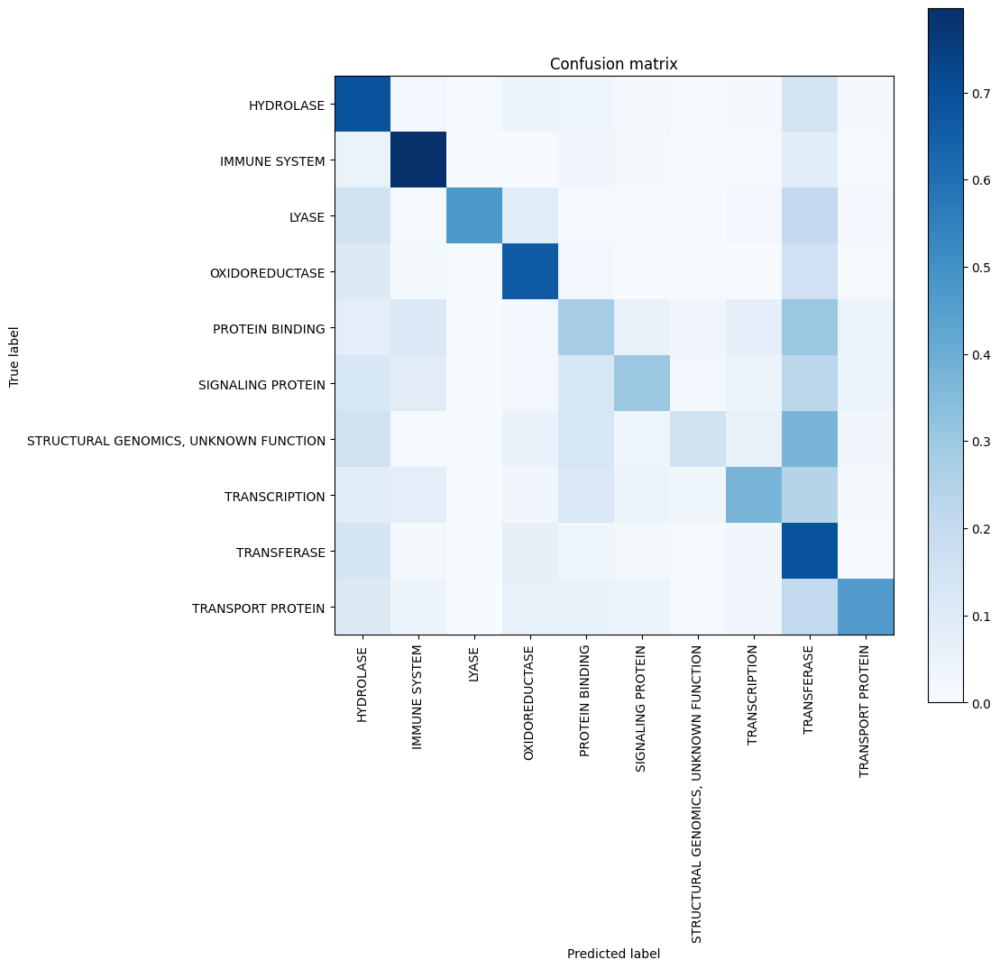

# Bioinformatics Sequence Classification

## Overview

This notebooks shows how to classify protein families soley based on their sequence of aminoacids. This work is based on the current success of deep learning models in natural language processing (NLP) and assumes the proteins sequences can be viewed as as a language. Please note, that there are notable search engines such as BLAST for this task.
## Sample images

## Table of Contents

- [Installation](#installation)
- [Datasets](#datasets)
- [Usage](#usage)
- [Model Architecture](#model-architecture)
- [Acknowledgments](#acknowledgments)

# Installation
To run this project, you will need to install the .ipynb file along with datasets. Follow the steps below to set up the environment:

# Datasets
Datasets can be found here : https://www.kaggle.com/datasets/shahir/protein-data-set

# Navigate to the project directory
run the .ipynb file making sure to use right configuration environment.
## Usage
To utilize the sequence classification model, you can load your biological sequence data and preprocess it using the provided functions. Below is a simple example of how to use the code:

#python
Copy code
import pandas as pd
from model import preprocess_data, build_model, train_model, evaluate_model

## Load your dataset
data = pd.read_csv('path_to_your_data.csv')

## Preprocess the data
X, y = preprocess_data(data)

## Build the classification model
model = build_model(input_shape=X.shape[1:])

## Train the model
train_model(model, X, y, epochs=10, batch_size=32)

## Evaluate the model
accuracy = evaluate_model(model, X_test, y_test)
print(f'Model Accuracy: {accuracy:.2f}')
Example Data Format
The input data should be in CSV format with columns for sequences and their corresponding classifications. Below is an example structure:

## Sequence	Classification
### MNIFEMLRIDEGLRLKIYKDTEGYYTIGIGHLLTKSPSLNAAAK	      Class A
### MNIFEMLRIDEGLRLKIYKDTEGYYTIGIGHLLTKSPSLNSLD	        Class B
Features
Data Preprocessing: Efficiently cleans and prepares biological sequences for modeling.
CNN Architecture: Utilizes a Convolutional Neural Network to learn patterns in sequence data.
Training and Evaluation: Functions for training the model and evaluating its performance with accuracy metrics.
## Model Architecture
The model comprises several layers designed to extract and learn from the sequence data effectively:

Embedding Layer: Transforms input sequences into dense vector representations.
Convolutional Layers: Multiple convolutional layers to capture spatial hierarchies in the data.
Pooling Layers: Reduces dimensionality while preserving essential features.
Dense Layers: Fully connected layers leading to the final classification output.

## Acknowledgments
TensorFlow for providing the deep learning framework utilized in this project.
Keras for simplifying the process of building neural networks.
Pandas for data manipulation and analysis.
Acknowledgments to any other libraries or resources that contributed to the development of this project.
